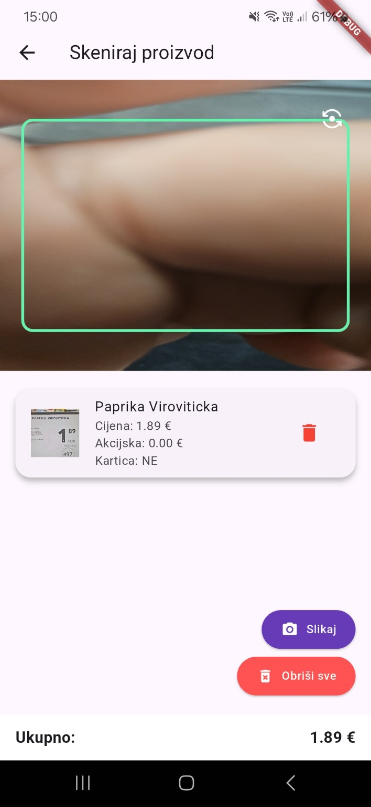

# SkeniKošarica

Aplikacija koja korisnicima omogućuje da **skeniranjem proizvoda direktno s etiketa u trgovini** automatski dobiju naziv, cijenu i dodatne informacije — uz pregled ukupne potrošnje.

---

## 📸 Pregled aplikacije

Aplikacija omogućuje skeniranje etiketa proizvoda u trgovini i automatski prikazuje:

- Naziv proizvoda
- Cijenu i akcijsku cijenu (ako postoji)
- Potrebu za karticom pogodnosti
- Ukupnu potrošnju
- Brisanje pojedinačnih stavki ili svih proizvoda
- Unos količine prije dodavanja u popis

### Prikaz ekrana

---

## ⚙️ Funkcionalnosti

- 📷 Skeniranje etiketa s polica pomoću kamere
- 🤖 AI analiza slike i prepoznavanje teksta (naziv, cijena, akcija, kartica)
- 🔢 Unos količine (npr. 3 komada = 3 unosa)
- 📋 Lista proizvoda s prikazom osnovnih informacija
- 🗑️ Brisanje pojedinačnih ili svih proizvoda
- 💰 Ukupan izračun potrošnje
- 📦 Lokalna pohrana putem Hive baze

---

## 🚀 Tehnologije

- **Flutter** – cross-platform razvoj
- **Hive** – lokalna baza podataka
- **Camera plugin** – za rad s kamerom
- **Image cropping** – za precizno označavanje etikete
- **Material 3 dizajn** – moderan UI/UX
